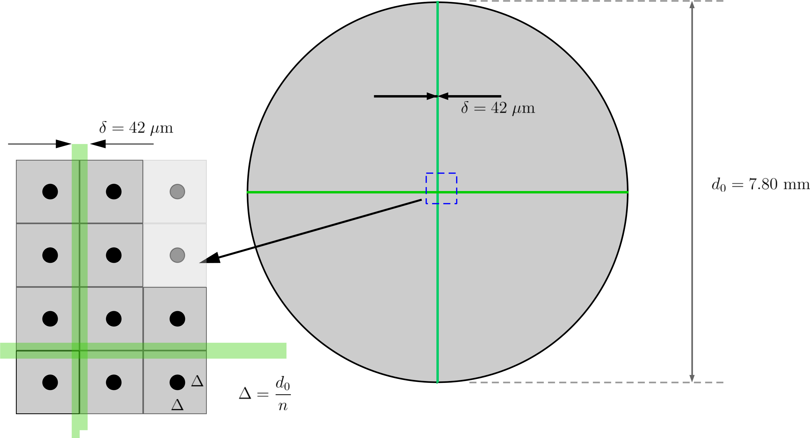

# Summary

`QuadCellDetector` is a python package that allows one to simulate the response
of a quadrant cell photodiode to the passage of a Gaussian laser beam across 
its surface. Quadrant cell photodiodes (as the name implies) are silicon 
photodiodes split into four quadrants (with a small gap separating each 
quadrant). The detector geomety parameters are shown in  
  
Another quadrant cell detector variety has a square shape (see, for example
[@square-photodiode]), but this package does *not* implement this square 
geometry. 

Typically, the photocurrent from each cell is amplified and turned into a 
voltage signal which is proportional to the total luminous energy incident on 
the quadrant. Quadrant cell detectors return three different signals: 

1.  The sum of all four quadrants,
2.	The sum of the two top quadrants minus the two bottom quadrants,
3. 	The sum of the two left quadrants minus the two right quadrants.

and in this way, one can tell when light is on the detector (sum signal 
non-zero) and whether it is centered (sum at maximum, top - bottom = 0 and 
left - right = 0). In addition, if a gaussian beam traverses the detector 
from left to right (while centered vertically), the position of the spot can 
be accurately ascertained (assuming one knows the size of the Gaussian beam).

The goals of this package are to allow the user to  
1.  Simulate the response of a given circular photodiode to the passage of a 
    Gaussian beam that traverses the detector in *any* user specified path.  
2.  Use this simulation to match the output of the detector when an actual beam
    is manually swept across the detector; since the only adjustable parameter 
    in this simulation is the width of the Gaussian beam, is is a simple matter
    to vary this parameter until one obtains a match to experimental data.  
3.  Use the simulation to be able to study the frequency content of a given 
    spot's path across the detector.   

It should be noted that theoretical papers on this matter (see for instance 
[@QPD-Sensitivity] and [@Zucker]) do not attempt to
account for the loss of signal due to the gap in the photodetector, and even
the paper by [@QPD-Sensitivity] does not give a closed form solution to the 
signal itself. After roughly 30 minutes of cpu time on a iMacPro, Mathematica 
cannot compute a closed form symbolic solution. Our python package
allows the user to accurately numerically model the detector response by including the actual
specifications a given circular photodiode, and it correctly deals with the lost
signal in the gap. 
# Acknowledgements

We thank Kallee Gallant for drawing the figures in Tikz! 

# References
